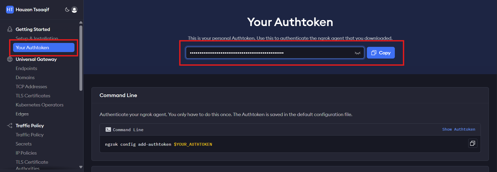
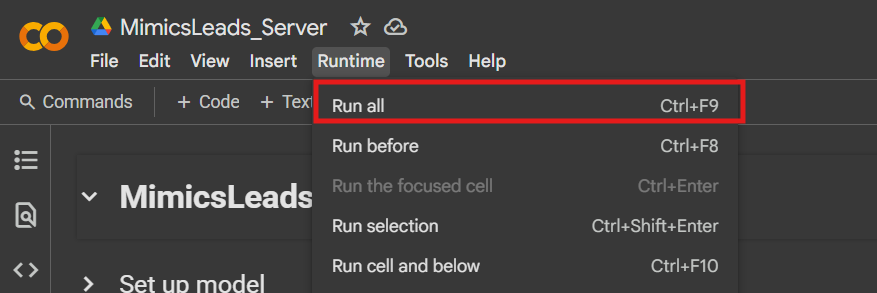
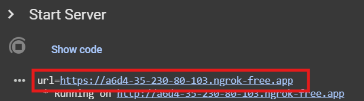

# 🎯 **MimicsLeads — AI-Powered Lead Generation Tool**

**MimicsLeads** is an intelligent lead generation platform designed to help businesses find the right leads faster and more efficiently. Powered by **Natural Language Processing (NLP)** and **custom-trained AI models**, MimicsLeads matches your profile description with thousands of curated leads based on **semantic similarity** — no more tedious manual searching.

> 🧠 Upload your company description or provide a short bio. Let the AI find your best-fit leads in seconds.


---

## 🚀 **Key Features**

- 🤖 **AI-Powered Matching**: Automatically matches your profile with lead descriptions using semantic embedding techniques.
- 📄 **Company Description or Text Input**: Upload your company profile or describe your ideal lead manually.
- 🔍 **Smart Retrieval**: Uses **SBERT** (Sentence-BERT) semantic search to find the most relevant leads.
- 🌐 **Built with Next.js**: A modern, performant, and scalable frontend framework.

---

## 🧠 **The AI Model**

The core matching engine uses **Sentence-BERT (SBERT)** fine-tuned on a **custom-mined lead dataset**. It evaluates the semantic similarity between user input and lead descriptions to deliver highly accurate results.

- 🤗 **Model Hosted on Hugging Face**:  
  🔗 [MimicsLeads Model on Hugging Face](https://huggingface.co/hauzantsaaqif/company_desc_needs)

- 📚 **Custom dataset mined from large-scale lead data**
- 🔍 **Embedding-based similarity matching**: To match descriptions with the most relevant leads, the model uses semantic similarity based on Sentence-BERT embeddings.
- 🤖 **Pre-trained Model**: The core model used in MimicsLeads is sentence-transformers/all-MiniLM-L6-v2, a pre-trained model that has been fine-tuned to better understand and compare company descriptions with potential leads. This model leverages transformer-based architecture for efficient sentence-level embeddings, which enables precise matching and ranking of leads based on text descriptions.

---

## 🛰️ **Model Deployment (Server)**

The backend model is served via:

- ☁️ **Google Colab** for lightweight, serverless hosting
- 🌐 **Ngrok** for exposing FastAPI endpoints publicly
- ⚡ **FastAPI** for efficient inference serving

To deploy the model:

1. Open the Colab notebook:  
   [📓 Colab Server Notebook](https://colab.research.google.com/drive/1rKuB3zvjuqfuZ3PgZDAEyMLi7XRvK4tk?usp=sharing)

2. Replace the **NGROK_AUTH_TOKEN** with your own key when prompted.
   You can generate your own Ngrok Auth Token by signing up at Ngrok.

3. Replace the Hugging Face API Key with your own.
   You can obtain an API key by signing up at Hugging Face.

4. Run the Setup Model Cell:
   This will configure the model for use with the API and prepare it for inference.

5. Run the Setup Server Cell:
   This will start the server and generate the Ngrok Public URL.

6. Copy the Ngrok Public URL:
   Once the server starts, you will see the Ngrok Public URL. Copy this URL.

Integrate the API Link into Your Project:
Paste the Ngrok Public URL into your MimicsLeads project under the API configuration to connect website with the backend server.

---

## 🔧 MimicsLeads Web App - Getting Started (User-Friendly)

Welcome to MimicsLeads! Follow the steps below to get started and set up your API connection.

### 1. **Visit the Website**

- Go to the MimicsLeads Web App at [https://mimicsleads.vercel.app/](https://mimicsleads.vercel.app/).

### 2. **Go to the Settings Page**

- Once you're on the homepage, click on the **Settings** link in the navigation bar or directly navigate to the settings page.

### 3. **Create an Account on Ngrok**

- Go to [Ngrok's website](https://ngrok.com/) and create an account.
- Once logged in, copy your **NGROK Auth Token**.  
  **(See example image below)**



### 4. **Open the AI Server on Colab**

- Open the AI server on Google Colab by clicking the link below:  
  [Colab Server Link](https://colab.research.google.com/drive/1rKuB3zvjuqfuZ3PgZDAEyMLi7XRvK4tk?usp=sharing#scrollTo=RddER8iVL4jn)

### 5. **Paste Your Ngrok Token**

- In the Colab notebook, find the input field for Ngrok Token.
- Paste your **Ngrok Auth Token** into this input field.

### 6. **Connect to Colab Runtime**

- You don't need a GPU, just connect to the Colab runtime by clicking the **Connect** button in the top-right corner.

### 7. **Run All Cells**

- Press `Ctrl + F9` or go to **Runtime > Run all** to execute all cells in the Colab notebook.  
  **(See example image below)**



### 8. **Copy the Generated API Link**

- Wait for the API link to appear. Once it does, copy the generated link.  
  **(See example image below)**



### 9. **Paste the API Link in Settings**

- Return to the MimicsLeads settings page.
- Paste the copied **API link** into the settings input field and click **Save API**.

### 10. **You're Ready to Start!**

- After saving the API link, you’re ready to start using MimicsLeads and enjoy the features! 🎉

---

### Need Help?

If you encounter any issues, feel free to reach out to our support team at hauzantsaaqif28@gmail.com.

---

## 🧑‍💻 **Running the Web App**

To use the **MimicsLeads** Web Interface:

1. **Clone the Repository**:

   ```bash
   git clone https://github.com/hauzantsaaqif/mimicsleads.git
   cd mimicsleads

   ```

2. **Update the API URL**:  
   Replace all model API URLs with the Ngrok Public URL you copied from Colab.

   Edit the following files:

- `src\pages\LandingPage.jsx`
- `src\pages\EnrichmentPage.jsx`

3. **Install dependencies**:

   ```bash
   npm install

   ```

4. **Start the UI Website**:

   ```bash
   npm run dev

   ```

Now, you're ready to test the app. Upload a food image and watch MimicsLeads break down the nutrition info automatically! 🍱

## Example Output


## 🧰 Tech Stack

- **Frontend**: Next.js (React + TypeScript)
- **Backend**: FastAPI (served via Colab + Ngrok)
- **Model**: SBERT (custom fine-tuned model)
- **Deployment**: Google Colab + Ngrok
- **Data**: Custom-mined scholarship dataset

---

📺 **For a full demonstration, watch the documentation video here**:  
[👉 SkuleMate Demo on YouTube](https://youtu.be/4cr4sBc51B0)

---

## 🤝 Contributions

Contributions are welcome!
Feel free to open issues or submit pull requests to improve SkuleMate.

---

## 📄 License

This project is licensed under the **MIT License** — use freely with attribution.

---

> “No more endless browsing. Let SkuleMate find the right scholarship for you.”
